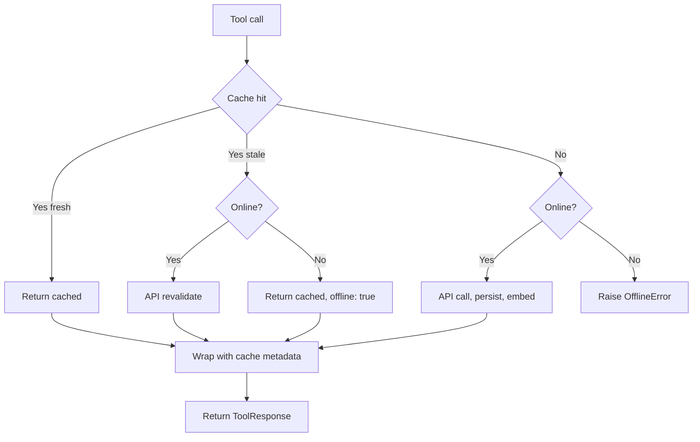

# scholar-paper-mcp

Hybrid MCP server for Semantic Scholar. 15 tools, persistent SQLite cache, offline fallback, multilingual semantic search.

Pairs with document-writing skill for hackathon, proposal, thesis, and article workflows.

## Features

- 15 tools: paper/author search, details, citations, references, recommendations, related, session tracking, BibTeX export
- Persistent SQLite cache with 30-day TTL. Repeat queries cost zero.
- Offline fallback: when Semantic Scholar is unreachable, return cached data with offline flag.
- Multilingual semantic search via `intfloat/multilingual-e5-small` (100+ languages including Indonesian).
- FastMCP stdio transport, OpenCode-compatible.

## Install

Requires Python 3.13 and uv.

```bash
git clone https://github.com/TudeOrangBiasa/scholar-paper-mcp
cd scholar-paper-mcp
uv sync

# Download embedding model (~118MB, one time)
# See models/README.md for details
```

## Run

Stdio transport, default for MCP clients.

```bash
python -m scholar_paper_mcp
# or
scholar-paper-mcp
```

## OpenCode registration

Add to OpenCode MCP config (`~/.config/opencode/opencode.json` or equivalent):

```json
{
  "mcpServers": {
    "scholar-paper-mcp": {
      "command": "uv",
      "args": ["--directory", "/path/to/scholar-paper-mcp", "run", "scholar-paper-mcp"]
    }
  }
}
```

Replace `/path/to/scholar-paper-mcp` with your clone path.

## Tools (15)

| Tool | Description |
|------|-------------|
| `search_papers` | Search papers by query |
| `get_paper_details` | Get paper by ID, persists + embeds |
| `get_paper_citations` | Papers that cite this paper |
| `get_paper_references` | Papers referenced by this paper |
| `search_authors` | Search authors by name |
| `get_author_details` | Get author by ID, persists |
| `get_author_top_papers` | Top K papers by citation count |
| `find_author_duplicates` | Group authors by name similarity |
| `consolidate_authors` | Merge duplicate authors in storage |
| `get_paper_recommendations` | SS API recommendations |
| `get_related_papers` | Local KNN via semantic embeddings |
| `add_paper_to_session` | Track paper in working session |
| `list_session_papers_tool` | List papers in session |
| `remove_from_session_tool` | Remove paper from session |
| `export_session_bibtex` | Export session as BibTeX string |

Every tool returns a `ToolResponse` with `data` and `meta` (cache metadata: source, cached, offline, fetched_at, ttl_until).

## Configuration

See [docs/CONFIGURATION.md](docs/CONFIGURATION.md) for all `SPM_*` environment variables.

## Architecture



## Development

```bash
uv run pytest           # all tests
uv run ruff check       # lint
uv run ty check         # type check
uv run ruff format      # auto-format
```

See [docs/PLAN.md](docs/PLAN.md) for the full plan, [docs/WORKFLOW.md](docs/WORKFLOW.md) for document-writing integration, [docs/CONFIGURATION.md](docs/CONFIGURATION.md) for env vars.

## License

MIT. See [LICENSE](LICENSE).
