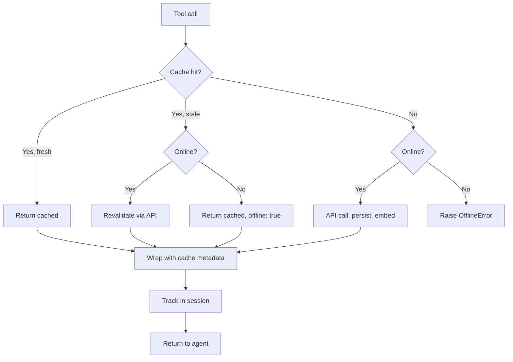

# scholar-paper-mcp: Plan

## What this is

Hybrid MCP server for Semantic Scholar. Same 14 tools as the upstream reference, but with a persistent SQLite cache so repeat lookups cost nothing, plus offline fallback when the API hiccups. Designed for hackathon, proposal, thesis, and article workflows. Pairs with the document-writing skill: search, list tracked papers, export BibTeX, paste into the document.

**Multilingual support**: primary user is Indonesian developer. Embedding model handles 100+ langs including Indonesian natively. Search queries in any language work.

Reference: https://github.com/akapet00/semantic-scholar-mcp

## How it works

Per tool call:

1. Check SQLite cache for endpoint + params
2. Hit and fresh → return cached
3. Hit and stale → revalidate if online, else return with offline flag
4. Miss → fetch from API, persist, embed, return
5. Wrap every response with cache metadata: `cached`, `fetched_at`, `source`, `offline`

Offline detection: 2s probe to the SS API, 60s grace period between probes to avoid hammering.



## Storage

SQLite at `~/.local/share/scholar-paper-mcp/cache.db` (XDG path, override via env).

Tables:

- `papers`: SS paperId primary key, DOI/ArXiv indexed, year, citation count, raw JSON, fetched_at, ttl_until
- `authors`: SS authorId primary key, name, h-index, raw JSON
- `paper_authors`: many-to-many
- `citations`: A cites B
- `paper_references`: A references B (renamed from `references`, SQL reserved word)
- `session_papers`: tracks papers fetched this session, persists across restarts
- `embeddings_vec`: sqlite-vec virtual column, 384-dim float vectors
- FTS5 virtual table `papers_fts` synced with `papers` via triggers

## Vector search

Bundle `intfloat/multilingual-e5-small` int8 ONNX (~118MB) in `models/`. Multilingual bi-encoder, 100+ langs including Indonesian (MIRACL 50.7 nDCG@10). 384-dim output, XLM-R SentencePiece tokenizer, MIT license.

**Required prefix** at encode time (baked into mE5 training):
- Search queries: prepend `"query: "`
- Indexed documents: prepend `"passage: "`
- Skip prefix = significant quality drop

Embed new papers on insert. KNN search for "find similar" offline. Fall back to FTS5 lexical search if the model fails to load. Never fail loud, degrade gracefully.

**Rerank deferred to v3**: no cross-encoder under 200MB int8 has Indonesian benchmark. Only candidates that fit (mmarco-mMiniLMv2-L6/L12) train on machine-translated mMARCO with no published MIRACL/ID score. Bundling one would add 70-118MB for unverified gain. Bi-encoder alone covers ID natively at 118MB total. Re-evaluate after v1 ships and corpus testing shows ranking problems.

## Env vars

Prefix `SPM_` (Scholar Paper MCP):

- `SPM_API_KEY`: Semantic Scholar API key for higher rate limits
- `SPM_CACHE_PATH`: default `~/.local/share/scholar-paper-mcp/cache.db`
- `SPM_CACHE_TTL`: default 30 days (papers are immutable, unlike the reference's 5 min in-memory TTL)
- `SPM_OFFLINE_MODE`: force offline, never call API
- `SPM_EMBEDDING_MODEL`: default `intfloat/multilingual-e5-small` int8 ONNX, `none` to disable
- `SPM_DEFAULT_*_LIMIT`: search, papers, citations defaults

## Module layout

```
src/scholar_paper_mcp/
  server.py            # FastMCP entry
  config.py            # SPM_* env vars
  models.py            # Pydantic models
  exceptions.py
  storage/
    db.py, schema.sql
    papers.py, authors.py, citations.py, sessions.py
    cache.py           # cache hit/miss decorator
    embeddings.py      # sqlite-vec + ONNX
    fts.py             # FTS5 search
  api/
    client.py          # SS HTTP client
    rate_limiter.py
    circuit_breaker.py
  tools/
    _common.py
    papers.py          # 4 tools
    authors.py         # 5 tools
    recommendations.py # 2 tools
    session.py         # 3 tools
  bibtex.py
  offline.py
  logging_config.py
models/                # bundled ONNX + tokenizer
```

## Issues (14 total, 8 to 12 days)

**Tranche A: Foundation**

1. Scaffold repo (pyproject.toml, uv, ruff, ty, pytest, AGENTS.md, README, LICENSE)
2. Config, exceptions, Pydantic models

**Tranche B: Storage**

3. SQLite schema and migrations
4. Storage CRUD: papers, authors, citations, sessions
5. Embeddings + FTS5 (mE5-small int8, query/passage prefix)

**Tranche C: API and cache**

6. Semantic Scholar HTTP client (port from reference)
7. Persistent cache decorator
8. Offline detection

**Tranche D: Tools**

9. Paper tools: search, details, citations, references
10. Author tools: search, details, top, duplicates, consolidate
11. Recommendation tools: recommendations, related
12. Session and BibTeX export

**Tranche E: Wiring**

13. FastMCP server entry, integrate offline + cache metadata into every response

**Tranche F: Docs**

14. README, CONFIGURATION.md, OpenCode registration snippet, document-writing workflow notes

## Risks

1. SS API rate limits (5k per 5 min shared): token bucket + circuit breaker, cache means repeat queries cost zero
2. sqlite-vec and ONNX bundle size: git LFS for multilingual-e5-small int8 model, ~118MB
3. ONNX model offline availability: fall back to FTS5 with a warning, never fail
4. FastMCP stdio on OpenCode: same protocol as Claude Code, low risk, verify in issue 13
5. Stale cached papers: papers are immutable, 30 day TTL is conservative, add a `revalidate` tool later if needed
6. Schema migration: single `schema.sql` with `PRAGMA user_version`, no ORM
7. Long citation chains: paginate, cache each page, limit 1000 per call

## Open questions

1. Embedding model: settled on `intfloat/multilingual-e5-small` int8 ONNX (118MB, 384-dim, MIT). Source: git LFS. Rerank: deferred to v3, no small multilingual cross-encoder with Indonesian benchmark.
2. Cache schema migration tool: provide `spm migrate` CLI? Or rely on `PRAGMA user_version`? My pick: pragma + embedded migrations.
3. Citation export formats: BibTeX only, or also CSL-JSON, RIS, EndNote? My pick: BibTeX v1, add others later.
4. Issue tracker: GitHub Issues once pushed, or in-repo markdown tracker? My pick: GitHub Issues.

## Status

Foundation in progress. Issues #1, #2, #3 done. Embedding: mE5-small int8. Rerank: deferred to v3.
